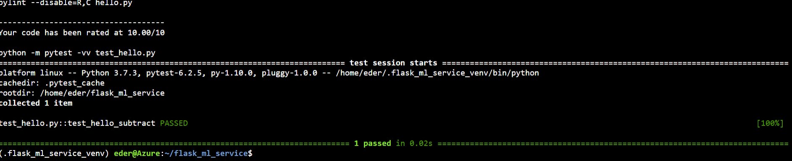

# Overview

The intent of this project is to build a CI/CD pipeline using technologies like GitHub Actions, Azure Pipelines, Azure WebApps for a python application that can predict price of Boston houses.

## Project Plan

* [Trello Kanban Board](https://trello.com/b/gu4n96dM/ci-cd-building)
* [Project Spreadsheet](https://docs.google.com/spreadsheets/d/1R8XEtrZSGL8rfAGERKwCfIwYk_Ofg94HRHNT0C8STgY/edit?usp=sharing)

## Instructions

### Running on Azure Cloud Shell User Context

- Launch Azure Cloud Shell
  

  
- Clone this Repository

`git clone https://github.com/ederff/flask_ml_service.git`

- Access the project folder and run `make all`:

- Run the application using Azure App Service:

`az webapp up -g <your_resource_group> --name <your_app_name>`

- Access your application from the browser and make sure you can see this message.

- Run predict script with the correct application url name to validate the API functionality

### Automatic Deployment

- Once a new code is committed to this repository, it will trigger GitHub Actions Job to build, lint and test the code.

- Also Azure Pipeline is going to Deploy the Applciation automatically into Azure App Services

- You can test through Browser and also running the predict script:

* Output of streamed log files from deployed application

> 2021-10-06T19:52:56  Welcome, you are now connected to log-streaming service.

Starting Log Tail -n 10 of existing logs ----
2021-10-06T17:23:10.013104799Z
2021-10-06T17:23:10.013145700Z   _____
2021-10-06T17:23:10.013152501Z   /  _  \ __________ _________   ____
2021-10-06T17:23:10.013157001Z  /  /_\  \___   /  |  \_  __ \_/ __ \
2021-10-06T17:23:10.013161501Z /    |    \/    /|  |  /|  | \/\  ___/
2021-10-06T17:23:10.013166001Z \____|__  /_____ \____/ |__|    \___  >
2021-10-06T17:23:10.013170601Z         \/      \/                  \/
2021-10-06T17:23:10.013175001Z
2021-10-06T17:23:10.013178901Z A P P   S E R V I C E   O N   L I N U X
2021-10-06T17:23:10.013183002Z
2021-10-06T17:23:10.013186902Z Documentation: http://aka.ms/webapp-linux
2021-10-06T17:23:10.013191002Z Python 3.7.9
2021-10-06T17:23:10.013195002Z Note: Any data outside '/home' is not persisted
2021-10-06T17:23:10.689484378Z Starting OpenBSD Secure Shell server: sshd.
2021-10-06T17:23:10.734005172Z App Command Line not configured, will attempt auto-detect
2021-10-06T17:23:10.735152208Z Launching oryx with: create-script -appPath /home/site/wwwroot -output /opt/startup/startup.sh -virtualEnvName antenv -defaultApp /opt/defaultsite -bindPort 8000
2021-10-06T17:23:10.829840173Z Cound not find build manifest file at '/home/site/wwwroot/oryx-manifest.toml'
2021-10-06T17:23:10.829871874Z Could not find operation ID in manifest. Generating an operation id...
2021-10-06T17:23:10.829877374Z Build Operation ID: 99674e19-919a-47c9-95c6-3465350f587e
2021-10-06T17:23:11.415810121Z Oryx Version: 0.2.20210708.1, Commit: 6ceb6608673b94827bac111ef5ea01c216f92abb, ReleaseTagName: 20210708.1
2021-10-06T17:23:11.422033416Z No framework detected; using default app from /opt/defaultsite
2021-10-06T17:23:11.422767539Z Generating `gunicorn` command for 'application:app'
2021-10-06T17:23:11.900410795Z Writing output script to '/opt/startup/startup.sh'
2021-10-06T17:23:12.498022607Z WARNING: Could not find virtual environment directory /home/site/wwwroot/antenv.
2021-10-06T17:23:12.499040939Z WARNING: Could not find package directory /home/site/wwwroot/__oryx_packages__.
2021-10-06T17:23:12.896430183Z [2021-10-06 17:23:12 +0000] [35] [INFO] Starting gunicorn 20.1.0
2021-10-06T17:23:12.897818026Z [2021-10-06 17:23:12 +0000] [35] [INFO] Listening at: http://0.0.0.0:8000 (35)
2021-10-06T17:23:12.898476647Z [2021-10-06 17:23:12 +0000] [35] [INFO] Using worker: sync
2021-10-06T17:23:12.914779857Z [2021-10-06 17:23:12 +0000] [38] [INFO] Booting worker with pid: 38
2021-10-06T17:23:13.876851782Z 172.16.0.1 - - [06/Oct/2021:17:23:13 +0000] "GET /robots933456.txt HTTP/1.1" 404 232 "-" "HealthCheck/1.0"
2021-10-06T17:25:21.638398211Z 172.16.0.1 - - [06/Oct/2021:17:25:21 +0000] "GET / HTTP/1.1" 200 0 "-" "Mozilla/5.0 (Windows NT 10.0; Win64; x64) AppleWebKit/537.36 (KHTML, like Gecko) Chrome/94.0.4606.61 Safari/537.36"
2021-10-06T17:25:13.385825330Z
2021-10-06T17:25:13.385873131Z   _____
2021-10-06T17:25:13.385880931Z   /  _  \ __________ _________   ____
2021-10-06T17:25:13.385885432Z  /  /_\  \___   /  |  \_  __ \_/ __ \
2021-10-06T17:25:13.385889932Z /    |    \/    /|  |  /|  | \/\  ___/
2021-10-06T17:25:13.385894332Z \____|__  /_____ \____/ |__|    \___  >
2021-10-06T17:25:13.385899132Z         \/      \/                  \/
2021-10-06T17:25:13.385903632Z
2021-10-06T17:25:13.385907532Z A P P   S E R V I C E   O N   L I N U X
2021-10-06T17:25:13.385911632Z
2021-10-06T17:25:13.385915533Z Documentation: http://aka.ms/webapp-linux
2021-10-06T17:25:13.385919733Z Python 3.7.9
2021-10-06T17:25:13.385923733Z Note: Any data outside '/home' is not persisted
2021-10-06T17:25:13.495829873Z Starting OpenBSD Secure Shell server: sshd.
2021-10-06T17:25:13.535091403Z App Command Line not configured, will attempt auto-detect
2021-10-06T17:25:13.536043632Z Launching oryx with: create-script -appPath /home/site/wwwroot -output /opt/startup/startup.sh -virtualEnvName antenv -defaultApp /opt/defaultsite -bindPort 8000
2021-10-06T17:25:13.557616908Z Found build manifest file at '/home/site/wwwroot/oryx-manifest.toml'. Deserializing it...
2021-10-06T17:25:13.564497323Z Build Operation ID: |AQYTd/hvXSA=.cd82b3d1_
2021-10-06T17:25:13.565435753Z Oryx Version: 0.2.20210708.1, Commit: 6ceb6608673b94827bac111ef5ea01c216f92abb, ReleaseTagName: 20210708.1
2021-10-06T17:25:13.566651991Z Output is compressed. Extracting it...
2021-10-06T17:25:13.566773994Z Extracting '/home/site/wwwroot/output.tar.gz' to directory '/tmp/8d988edf50a5370'...
2021-10-06T17:25:18.552318967Z App path is set to '/tmp/8d988edf50a5370'
2021-10-06T17:25:24.552811336Z Detected an app based on Flask
2021-10-06T17:25:24.552881138Z Generating `gunicorn` command for 'app:app'
2021-10-06T17:25:30.561801763Z Writing output script to '/opt/startup/startup.sh'
2021-10-06T17:25:30.598223708Z Using packages from virtual environment antenv located at /tmp/8d988edf50a5370/antenv.
2021-10-06T17:25:30.599008933Z Updated PYTHONPATH to ':/tmp/8d988edf50a5370/antenv/lib/python3.7/site-packages'
2021-10-06T17:25:31.082676740Z [2021-10-06 17:25:31 +0000] [36] [INFO] Starting gunicorn 20.1.0
2021-10-06T17:25:31.083834377Z [2021-10-06 17:25:31 +0000] [36] [INFO] Listening at: http://0.0.0.0:8000 (36)
2021-10-06T17:25:31.085217420Z [2021-10-06 17:25:31 +0000] [36] [INFO] Using worker: sync
2021-10-06T17:25:31.090002370Z [2021-10-06 17:25:31 +0000] [39] [INFO] Booting worker with pid: 39
2021-10-06T17:25:35.835818761Z 172.16.0.1 - - [06/Oct/2021:17:25:35 +0000] "GET /robots933456.txt HTTP/1.1" 404 232 "-" "HealthCheck/1.0"
2021-10-06T17:26:32.420863051Z 172.16.0.1 - - [06/Oct/2021:17:26:32 +0000] "GET / HTTP/1.1" 200 32 "-" "Mozilla/5.0 (Windows NT 10.0; Win64; x64) AppleWebKit/537.36 (KHTML, like Gecko) Chrome/94.0.4606.61 Safari/537.36"
2021-10-06T17:26:33.197496235Z 172.16.0.1 - - [06/Oct/2021:17:26:33 +0000] "GET /favicon.ico HTTP/1.1" 404 232 "https://flask-ml-service-ederff123.azurewebsites.net/" "Mozilla/5.0 (Windows NT 10.0; Win64; x64) AppleWebKit/537.36 (KHTML, like Gecko) Chrome/94.0.4606.61 Safari/537.36"
2021-10-06T17:27:59.313044948Z 172.16.0.1 - - [06/Oct/2021:17:27:59 +0000] "GET / HTTP/1.1" 200 32 "-" "AlwaysOn"
2021-10-06T17:28:08.750819375Z /tmp/8d988edf50a5370/antenv/lib/python3.7/site-packages/sklearn/ensemble/gradient_boosting.py:34: DeprecationWarning: `np.bool` is a deprecated alias for the builtin `bool`. To silence this warning, use `bool` by itself. Doing this will not modify any behavior and is safe. If you specifically wanted the numpy scalar type, use `np.bool_` here.
2021-10-06T17:28:08.750865476Z Deprecated in NumPy 1.20; for more details and guidance: https://numpy.org/devdocs/release/1.20.0-notes.html#deprecations
2021-10-06T17:28:08.750873577Z   from ._gradient_boosting import predict_stages
2021-10-06T17:28:08.750878477Z /tmp/8d988edf50a5370/antenv/lib/python3.7/site-packages/sklearn/ensemble/gradient_boosting.py:34: DeprecationWarning: `np.bool` is a deprecated alias for the builtin `bool`. To silence this warning, use `bool` by itself. Doing this will not modify any behavior and is safe. If you specifically wanted the numpy scalar type, use `np.bool_` here.
2021-10-06T17:28:08.750883777Z Deprecated in NumPy 1.20; for more details and guidance: https://numpy.org/devdocs/release/1.20.0-notes.html#deprecations
2021-10-06T17:28:08.750888777Z   from ._gradient_boosting import predict_stages
2021-10-06T17:28:08.750893777Z [2021-10-06 17:28:08,750] INFO in app: JSON payload: %s json_payload
2021-10-06T17:28:08.755143010Z [2021-10-06 17:28:08,753] INFO in app: inference payload DataFrame: %s inference_payload
2021-10-06T17:28:08.756102640Z [2021-10-06 17:28:08,755] INFO in app: Scaling Payload: %s payload
2021-10-06T17:28:08.763387568Z 172.16.0.1 - - [06/Oct/2021:17:28:08 +0000] "POST /predict HTTP/1.1" 200 35 "-" "curl/7.64.0"
2021-10-06T17:32:59.537399757Z 172.16.0.1 - - [06/Oct/2021:17:32:59 +0000] "GET / HTTP/1.1" 200 32 "-" "AlwaysOn"
2021-10-06T17:35:33.730839479Z 172.16.0.1 - - [06/Oct/2021:17:35:33 +0000] "GET / HTTP/1.1" 200 32 "-" "Mozilla/5.0 (Windows NT 10.0; Win64; x64) AppleWebKit/537.36 (KHTML, like Gecko) Chrome/94.0.4606.61 Safari/537.36"
2021-10-06T17:37:29.785871350Z 172.16.0.1 - - [06/Oct/2021:17:37:29 +0000] "GET / HTTP/1.1" 200 32 "-" "AlwaysOn"
2021-10-06T17:37:39.722284941Z 172.16.0.1 - - [06/Oct/2021:17:37:39 +0000] "GET / HTTP/1.1" 200 32 "-" "AlwaysOn"
2021-10-06T17:37:49.752418629Z 172.16.0.1 - - [06/Oct/2021:17:37:49 +0000] "GET / HTTP/1.1" 200 32 "-" "AlwaysOn"
2021-10-06T17:37:29.506311245Z
2021-10-06T17:37:29.506361647Z   _____
2021-10-06T17:37:29.506370747Z   /  _  \ __________ _________   ____
2021-10-06T17:37:29.506375248Z  /  /_\  \___   /  |  \_  __ \_/ __ \
2021-10-06T17:37:29.506379748Z /    |    \/    /|  |  /|  | \/\  ___/
2021-10-06T17:37:29.506384148Z \____|__  /_____ \____/ |__|    \___  >
2021-10-06T17:37:29.506388848Z         \/      \/                  \/
2021-10-06T17:37:29.506393348Z
2021-10-06T17:37:29.506397249Z A P P   S E R V I C E   O N   L I N U X
2021-10-06T17:37:29.506401349Z
2021-10-06T17:37:29.506405349Z Documentation: http://aka.ms/webapp-linux
2021-10-06T17:37:29.506409449Z Python 3.7.9
2021-10-06T17:37:29.506413549Z Note: Any data outside '/home' is not persisted
2021-10-06T17:37:29.591024874Z Starting OpenBSD Secure Shell server: sshd.
2021-10-06T17:37:29.623122787Z App Command Line not configured, will attempt auto-detect
2021-10-06T17:37:29.624904665Z Launching oryx with: create-script -appPath /home/site/wwwroot -output /opt/startup/startup.sh -virtualEnvName antenv -defaultApp /opt/defaultsite -bindPort 8000
2021-10-06T17:37:29.641169581Z Found build manifest file at '/home/site/wwwroot/oryx-manifest.toml'. Deserializing it...
2021-10-06T17:37:29.645369466Z Build Operation ID: |vlbrn7BELCg=.4e5697cb_
2021-10-06T17:37:29.646710925Z Oryx Version: 0.2.20210708.1, Commit: 6ceb6608673b94827bac111ef5ea01c216f92abb, ReleaseTagName: 20210708.1
2021-10-06T17:37:29.647650266Z Output is compressed. Extracting it...
2021-10-06T17:37:29.650723701Z Extracting '/home/site/wwwroot/output.tar.gz' to directory '/tmp/8d988efc13d0816'...
2021-10-06T17:37:37.399443815Z App path is set to '/tmp/8d988efc13d0816'
2021-10-06T17:37:41.170619245Z Detected an app based on Flask
2021-10-06T17:37:41.170675447Z Generating `gunicorn` command for 'app:app'
2021-10-06T17:37:41.439591498Z Writing output script to '/opt/startup/startup.sh'
2021-10-06T17:37:41.523890806Z Using packages from virtual environment antenv located at /tmp/8d988efc13d0816/antenv.
2021-10-06T17:37:41.524690637Z Updated PYTHONPATH to ':/tmp/8d988efc13d0816/antenv/lib/python3.7/site-packages'
2021-10-06T17:37:42.026534026Z [2021-10-06 17:37:42 +0000] [36] [INFO] Starting gunicorn 20.1.0
2021-10-06T17:37:42.028044786Z [2021-10-06 17:37:42 +0000] [36] [INFO] Listening at: http://0.0.0.0:8000 (36)
2021-10-06T17:37:42.028751913Z [2021-10-06 17:37:42 +0000] [36] [INFO] Using worker: sync
2021-10-06T17:37:42.033983719Z [2021-10-06 17:37:42 +0000] [39] [INFO] Booting worker with pid: 39
2021-10-06T17:37:51.946409201Z 172.16.0.1 - - [06/Oct/2021:17:37:51 +0000] "GET /robots933456.txt HTTP/1.1" 404 232 "-" "HealthCheck/1.0"
2021-10-06T17:37:59.732443152Z 172.16.0.1 - - [06/Oct/2021:17:37:59 +0000] "GET / HTTP/1.1" 200 32 "-" "AlwaysOn"
2021-10-06T17:37:55.671311940Z
2021-10-06T17:37:55.671357242Z   _____
2021-10-06T17:37:55.671364342Z   /  _  \ __________ _________   ____
2021-10-06T17:37:55.671368442Z  /  /_\  \___   /  |  \_  __ \_/ __ \
2021-10-06T17:37:55.671372442Z /    |    \/    /|  |  /|  | \/\  ___/
2021-10-06T17:37:55.671376342Z \____|__  /_____ \____/ |__|    \___  >
2021-10-06T17:37:55.671380942Z         \/      \/                  \/
2021-10-06T17:37:55.671384743Z
2021-10-06T17:37:55.671388343Z A P P   S E R V I C E   O N   L I N U X
2021-10-06T17:37:55.671392143Z
2021-10-06T17:37:55.671395543Z Documentation: http://aka.ms/webapp-linux
2021-10-06T17:37:55.671399243Z Python 3.7.9
2021-10-06T17:37:55.671402843Z Note: Any data outside '/home' is not persisted
2021-10-06T17:37:55.852170526Z Starting OpenBSD Secure Shell server: sshd.
2021-10-06T17:37:55.884377874Z App Command Line not configured, will attempt auto-detect
2021-10-06T17:37:55.884724985Z Launching oryx with: create-script -appPath /home/site/wwwroot -output /opt/startup/startup.sh -virtualEnvName antenv -defaultApp /opt/defaultsite -bindPort 8000
2021-10-06T17:37:55.893370667Z Found build manifest file at '/home/site/wwwroot/oryx-manifest.toml'. Deserializing it...
2021-10-06T17:37:55.895324730Z Build Operation ID: |vlbrn7BELCg=.4e5697cb_
2021-10-06T17:37:55.896410066Z Oryx Version: 0.2.20210708.1, Commit: 6ceb6608673b94827bac111ef5ea01c216f92abb, ReleaseTagName: 20210708.1
2021-10-06T17:37:55.896609572Z Output is compressed. Extracting it...
2021-10-06T17:37:55.902627268Z Extracting '/home/site/wwwroot/output.tar.gz' to directory '/tmp/8d988efc13d0816'...
2021-10-06T17:38:01.537900930Z App path is set to '/tmp/8d988efc13d0816'
2021-10-06T17:38:02.376033790Z Detected an app based on Flask
2021-10-06T17:38:02.377523947Z Generating `gunicorn` command for 'app:app'
2021-10-06T17:38:02.866362183Z Writing output script to '/opt/startup/startup.sh'
2021-10-06T17:38:03.599187213Z Using packages from virtual environment antenv located at /tmp/8d988efc13d0816/antenv.
2021-10-06T17:38:03.612377116Z Updated PYTHONPATH to ':/tmp/8d988efc13d0816/antenv/lib/python3.7/site-packages'
2021-10-06T17:38:04.000271099Z [2021-10-06 17:38:03 +0000] [36] [INFO] Starting gunicorn 20.1.0
2021-10-06T17:38:04.002004065Z [2021-10-06 17:38:04 +0000] [36] [INFO] Listening at: http://0.0.0.0:8000 (36)
2021-10-06T17:38:04.002680391Z [2021-10-06 17:38:04 +0000] [36] [INFO] Using worker: sync
2021-10-06T17:38:04.007574177Z [2021-10-06 17:38:04 +0000] [39] [INFO] Booting worker with pid: 39
2021-10-06T17:38:08.141198385Z 172.16.0.1 - - [06/Oct/2021:17:38:08 +0000] "GET /robots933456.txt HTTP/1.1" 404 232 "-" "HealthCheck/1.0"
2021-10-06T17:38:09.732872205Z 172.16.0.1 - - [06/Oct/2021:17:38:09 +0000] "GET / HTTP/1.1" 200 32 "-" "AlwaysOn"
2021-10-06T17:41:28.790422402Z /tmp/8d988efc13d0816/antenv/lib/python3.7/site-packages/sklearn/ensemble/gradient_boosting.py:34: DeprecationWarning: `np.bool` is a deprecated alias for the builtin `bool`. To silence this warning, use `bool` by itself. Doing this will not modify any behavior and is safe. If you specifically wanted the numpy scalar type, use `np.bool_` here.
2021-10-06T17:41:28.790469504Z Deprecated in NumPy 1.20; for more details and guidance: https://numpy.org/devdocs/release/1.20.0-notes.html#deprecations
2021-10-06T17:41:28.790478204Z   from ._gradient_boosting import predict_stages
2021-10-06T17:41:28.790483204Z /tmp/8d988efc13d0816/antenv/lib/python3.7/site-packages/sklearn/ensemble/gradient_boosting.py:34: DeprecationWarning: `np.bool` is a deprecated alias for the builtin `bool`. To silence this warning, use `bool` by itself. Doing this will not modify any behavior and is safe. If you specifically wanted the numpy scalar type, use `np.bool_` here.
2021-10-06T17:41:28.790488604Z Deprecated in NumPy 1.20; for more details and guidance: https://numpy.org/devdocs/release/1.20.0-notes.html#deprecations
2021-10-06T17:41:28.790493404Z   from ._gradient_boosting import predict_stages
2021-10-06T17:41:28.790498004Z [2021-10-06 17:41:28,790] INFO in app: JSON payload: %s json_payload
2021-10-06T17:41:28.795335158Z [2021-10-06 17:41:28,795] INFO in app: inference payload DataFrame: %s inference_payload
2021-10-06T17:41:28.796062881Z [2021-10-06 17:41:28,795] INFO in app: Scaling Payload: %s payload
2021-10-06T17:41:28.808057163Z 172.16.0.1 - - [06/Oct/2021:17:41:28 +0000] "POST /predict HTTP/1.1" 200 35 "-" "curl/7.64.0"
2021-10-06T17:41:33.574606828Z 172.16.0.1 - - [06/Oct/2021:17:41:33 +0000] "GET / HTTP/1.1" 200 32 "-" "Mozilla/5.0 (Windows NT 10.0; Win64; x64) AppleWebKit/537.36 (KHTML, like Gecko) Chrome/94.0.4606.61 Safari/537.36"
2021-10-06T17:43:10.085268509Z 172.16.0.1 - - [06/Oct/2021:17:43:10 +0000] "GET / HTTP/1.1" 200 32 "-" "AlwaysOn"
2021-10-06T17:43:39.723423424Z
2021-10-06T17:43:39.723473426Z   _____
2021-10-06T17:43:39.723605830Z   /  _  \ __________ _________   ____
2021-10-06T17:43:39.723615831Z  /  /_\  \___   /  |  \_  __ \_/ __ \
2021-10-06T17:43:39.723620631Z /    |    \/    /|  |  /|  | \/\  ___/
2021-10-06T17:43:39.723625031Z \____|__  /_____ \____/ |__|    \___  >
2021-10-06T17:43:39.723630031Z         \/      \/                  \/
2021-10-06T17:43:39.723634531Z
2021-10-06T17:43:39.723638431Z A P P   S E R V I C E   O N   L I N U X
2021-10-06T17:43:39.723642432Z
2021-10-06T17:43:39.723646232Z Documentation: http://aka.ms/webapp-linux
2021-10-06T17:43:39.723650232Z Python 3.7.9
2021-10-06T17:43:39.723654232Z Note: Any data outside '/home' is not persisted
2021-10-06T17:43:39.837305126Z Starting OpenBSD Secure Shell server: sshd.
2021-10-06T17:43:39.867150623Z App Command Line not configured, will attempt auto-detect
2021-10-06T17:43:39.868149456Z Launching oryx with: create-script -appPath /home/site/wwwroot -output /opt/startup/startup.sh -virtualEnvName antenv -defaultApp /opt/defaultsite -bindPort 8000
2021-10-06T17:43:39.906458835Z Found build manifest file at '/home/site/wwwroot/oryx-manifest.toml'. Deserializing it...
2021-10-06T17:43:39.912334031Z Build Operation ID: |JZGdaSYeK5c=.d9b06a74_
2021-10-06T17:43:39.913405567Z Oryx Version: 0.2.20210708.1, Commit: 6ceb6608673b94827bac111ef5ea01c216f92abb, ReleaseTagName: 20210708.1
2021-10-06T17:43:39.914000087Z Output is compressed. Extracting it...
2021-10-06T17:43:39.917631508Z Extracting '/home/site/wwwroot/output.tar.gz' to directory '/tmp/8d988f0933d9219'...
2021-10-06T17:43:44.887220441Z App path is set to '/tmp/8d988f0933d9219'
2021-10-06T17:43:46.776003872Z Detected an app based on Flask2021-10-06T17:43:46.776039474Z Generating `gunicorn` command for 'app:app'
2021-10-06T17:43:47.373252889Z Writing output script to '/opt/startup/startup.sh'
2021-10-06T17:43:48.056006544Z Using packages from virtual environment antenv located at /tmp/8d988f0933d9219/antenv.
2021-10-06T17:43:48.056830770Z Updated PYTHONPATH to ':/tmp/8d988f0933d9219/antenv/lib/python3.7/site-packages'
2021-10-06T17:43:48.498183682Z [2021-10-06 17:43:48 +0000] [36] [INFO] Starting gunicorn 20.1.0
2021-10-06T17:43:48.499805732Z [2021-10-06 17:43:48 +0000] [36] [INFO] Listening at: http://0.0.0.0:8000 (36)
2021-10-06T17:43:48.500446852Z [2021-10-06 17:43:48 +0000] [36] [INFO] Using worker: sync
2021-10-06T17:43:48.505098395Z [2021-10-06 17:43:48 +0000] [39] [INFO] Booting worker with pid: 39
2021-10-06T17:43:52.620684112Z 172.16.0.1 - - [06/Oct/2021:17:43:52 +0000] "GET /robots933456.txt HTTP/1.1" 404 232 "-" "HealthCheck/1.0"
2021-10-06T17:43:53.166678255Z 172.16.0.1 - - [06/Oct/2021:17:43:53 +0000] "GET / HTTP/1.1" 200 54 "-" "Mozilla/5.0 (Windows NT 10.0; Win64; x64) AppleWebKit/537.36 (KHTML, like Gecko) Chrome/94.0.4606.61 Safari/537.36"
2021-10-06T17:43:58.037296969Z /tmp/8d988f0933d9219/antenv/lib/python3.7/site-packages/sklearn/ensemble/gradient_boosting.py:34: DeprecationWarning: `np.bool` is a deprecated alias for the builtin `bool`. To silence this warning, use `bool` by itself. Doing this will not modify any behavior and is safe. If you specifically wanted the numpy scalar type, use `np.bool_` here.
2021-10-06T17:43:58.037333370Z Deprecated in NumPy 1.20; for more details and guidance: https://numpy.org/devdocs/release/1.20.0-notes.html#deprecations
2021-10-06T17:43:58.037349571Z   from ._gradient_boosting import predict_stages
2021-10-06T17:43:58.037354771Z /tmp/8d988f0933d9219/antenv/lib/python3.7/site-packages/sklearn/ensemble/gradient_boosting.py:34: DeprecationWarning: `np.bool` is a deprecated alias for the builtin `bool`. To silence this warning, use `bool` by itself. Doing this will not modify any behavior and is safe. If you specifically wanted the numpy scalar type, use `np.bool_` here.
2021-10-06T17:43:58.037359771Z Deprecated in NumPy 1.20; for more details and guidance: https://numpy.org/devdocs/release/1.20.0-notes.html#deprecations
2021-10-06T17:43:58.037364271Z   from ._gradient_boosting import predict_stages
2021-10-06T17:43:58.037368571Z [2021-10-06 17:43:58,036] INFO in app: JSON payload: %s json_payload
2021-10-06T17:43:58.042123618Z [2021-10-06 17:43:58,041] INFO in app: inference payload DataFrame: %s inference_payload
2021-10-06T17:43:58.042863641Z [2021-10-06 17:43:58,042] INFO in app: Scaling Payload: %s payload
2021-10-06T17:43:58.050762685Z 172.16.0.1 - - [06/Oct/2021:17:43:58 +0000] "POST /predict HTTP/1.1" 200 35 "-" "curl/7.64.0"
2021-10-06T17:48:10.248716440Z 172.16.0.1 - - [06/Oct/2021:17:48:10 +0000] "GET / HTTP/1.1" 200 54 "-" "AlwaysOn"
2021-10-06T17:53:10.440955198Z 172.16.0.1 - - [06/Oct/2021:17:53:10 +0000] "GET / HTTP/1.1" 200 54 "-" "AlwaysOn"
2021-10-06T17:58:10.801123584Z 172.16.0.1 - - [06/Oct/2021:17:58:10 +0000] "GET / HTTP/1.1" 200 54 "-" "AlwaysOn"
2021-10-06T18:03:11.439407490Z 172.16.0.1 - - [06/Oct/2021:18:03:11 +0000] "GET / HTTP/1.1" 200 54 "-" "AlwaysOn"
2021-10-06T18:08:13.720542450Z 172.16.0.1 - - [06/Oct/2021:18:08:13 +0000] "GET / HTTP/1.1" 200 54 "-" "AlwaysOn"
2021-10-06T18:13:15.809372867Z 172.16.0.1 - - [06/Oct/2021:18:13:15 +0000] "GET / HTTP/1.1" 200 54 "-" "AlwaysOn"
2021-10-06T18:18:16.817613903Z 172.16.0.1 - - [06/Oct/2021:18:18:16 +0000] "GET / HTTP/1.1" 200 54 "-" "AlwaysOn"
2021-10-06T18:23:17.170141755Z 172.16.0.1 - - [06/Oct/2021:18:23:17 +0000] "GET / HTTP/1.1" 200 54 "-" "AlwaysOn"
2021-10-06T18:28:17.436928148Z 172.16.0.1 - - [06/Oct/2021:18:28:17 +0000] "GET / HTTP/1.1" 200 54 "-" "AlwaysOn"
2021-10-06T18:33:17.614141347Z 172.16.0.1 - - [06/Oct/2021:18:33:17 +0000] "GET / HTTP/1.1" 200 54 "-" "AlwaysOn"
2021-10-06T18:38:17.829246700Z 172.16.0.1 - - [06/Oct/2021:18:38:17 +0000] "GET / HTTP/1.1" 200 54 "-" "AlwaysOn"
2021-10-06T18:43:18.198954475Z 172.16.0.1 - - [06/Oct/2021:18:43:18 +0000] "GET / HTTP/1.1" 200 54 "-" "AlwaysOn"
2021-10-06T18:48:18.926079829Z 172.16.0.1 - - [06/Oct/2021:18:48:18 +0000] "GET / HTTP/1.1" 200 54 "-" "AlwaysOn"
2021-10-06T18:53:19.117728313Z 172.16.0.1 - - [06/Oct/2021:18:53:19 +0000] "GET / HTTP/1.1" 200 54 "-" "AlwaysOn"
2021-10-06T18:58:19.320572282Z 172.16.0.1 - - [06/Oct/2021:18:58:19 +0000] "GET / HTTP/1.1" 200 54 "-" "AlwaysOn"
2021-10-06T19:03:19.568773771Z 172.16.0.1 - - [06/Oct/2021:19:03:19 +0000] "GET / HTTP/1.1" 200 54 "-" "AlwaysOn"
2021-10-06T19:08:20.668951125Z 172.16.0.1 - - [06/Oct/2021:19:08:20 +0000] "GET / HTTP/1.1" 200 54 "-" "AlwaysOn"
2021-10-06T19:13:20.420593756Z 172.16.0.1 - - [06/Oct/2021:19:13:20 +0000] "GET / HTTP/1.1" 200 54 "-" "AlwaysOn"
2021-10-06T19:18:20.645999562Z 172.16.0.1 - - [06/Oct/2021:19:18:20 +0000] "GET / HTTP/1.1" 200 54 "-" "AlwaysOn"
2021-10-06T19:23:20.844394170Z 172.16.0.1 - - [06/Oct/2021:19:23:20 +0000] "GET / HTTP/1.1" 200 54 "-" "AlwaysOn"
2021-10-06T19:28:22.108654857Z 172.16.0.1 - - [06/Oct/2021:19:28:22 +0000] "GET / HTTP/1.1" 200 54 "-" "AlwaysOn"
2021-10-06T19:33:22.339021895Z 172.16.0.1 - - [06/Oct/2021:19:33:22 +0000] "GET / HTTP/1.1" 200 54 "-" "AlwaysOn"
2021-10-06T19:38:22.573243993Z 172.16.0.1 - - [06/Oct/2021:19:38:22 +0000] "GET / HTTP/1.1" 200 54 "-" "AlwaysOn"
2021-10-06T19:43:22.800508193Z 172.16.0.1 - - [06/Oct/2021:19:43:22 +0000] "GET / HTTP/1.1" 200 54 "-" "AlwaysOn"
2021-10-06T19:45:12.311475168Z /tmp/8d988f0933d9219/antenv/lib/python3.7/site-packages/sklearn/preprocessing/data.py:645: DataConversionWarning: Data with input dtype int64, float64 were all converted to float64 by StandardScaler.
2021-10-06T19:45:12.311545968Z   return self.partial_fit(X, y)
2021-10-06T19:45:12.311553468Z /tmp/8d988f0933d9219/app.py:18: DataConversionWarning: Data with input dtype int64, float64 were all converted to float64 by StandardScaler.
2021-10-06T19:45:12.311558568Z   scaled_adhoc_predict = scaler.transform(payload)
2021-10-06T19:45:12.311563168Z [2021-10-06 19:45:12,311] INFO in app: JSON payload: %s json_payload
2021-10-06T19:45:12.315618896Z [2021-10-06 19:45:12,314] INFO in app: inference payload DataFrame: %s inference_payload
2021-10-06T19:45:12.316401701Z [2021-10-06 19:45:12,315] INFO in app: Scaling Payload: %s payload
2021-10-06T19:45:12.322179540Z 172.16.0.1 - - [06/Oct/2021:19:45:12 +0000] "POST /predict HTTP/1.1" 200 35 "-" "curl/7.64.0"
2021-10-06T19:48:23.031726745Z 172.16.0.1 - - [06/Oct/2021:19:48:23 +0000] "GET / HTTP/1.1" 200 54 "-" "AlwaysOn"

/home/LogFiles/__lastCheckTime.txt  (https://flask-ml-service-ederff123.scm.azurewebsites.net/api/vfs/LogFiles/__lastCheckTime.txt)
10/06/2021 17:22:32

2021-10-06T17:22:21.312Z INFO  - Starting container for site
2021-10-06T17:22:21.312Z INFO  - docker run -d -p 3680:8000 --name flask-ml-service-ederff123_0_ca33f219 -e WEBSITE_SITE_NAME=flask-ml-service-ederff123 -e WEBSITE_AUTH_ENABLED=False -e WEBSITE_ROLE_INSTANCE_ID=0 -e WEBSITE_HOSTNAME=flask-ml-service-ederff123.azurewebsites.net -e WEBSITE_INSTANCE_ID=daf7c1c7185b466283c5921a93764dc45b9bf57d83f8c890310e26ca0bbe7abe appsvc/python:3.7_20210709.2
2021-10-06T17:22:21.312Z INFO  - Logging is not enabled for this container.Please use https://aka.ms/linux-diagnostics to enable logging to see container logs here.
2021-10-06T17:22:24.396Z INFO  - Initiating warmup request to container flask-ml-service-ederff123_0_ca33f219 for site flask-ml-service-ederff123
2021-10-06T17:22:38.584Z INFO  - Container flask-ml-service-ederff123_0_ca33f219 for site flask-ml-service-ederff123 initialized successfully and is ready to serve requests.
2021-10-06T17:23:06.148Z INFO  - Recycling container because of HttpLoggingEnabledChange and httpLoggingEnabled = True
2021-10-06T17:23:06.165Z INFO  - Starting container for site
2021-10-06T17:23:06.165Z INFO  - docker run -d -p 4893:8000 --name flask-ml-service-ederff123_1_8fddab22 -e WEBSITE_SITE_NAME=flask-ml-service-ederff123 -e WEBSITE_AUTH_ENABLED=False -e WEBSITE_ROLE_INSTANCE_ID=0 -e WEBSITE_HOSTNAME=flask-ml-service-ederff123.azurewebsites.net -e WEBSITE_INSTANCE_ID=daf7c1c7185b466283c5921a93764dc45b9bf57d83f8c890310e26ca0bbe7abe -e HTTP_LOGGING_ENABLED=1 appsvc/python:3.7_20210709.2
2021-10-06T17:23:09.792Z INFO  - Initiating warmup request to container flask-ml-service-ederff123_1_8fddab22 for site flask-ml-service-ederff123
2021-10-06T17:23:13.861Z INFO  - Container flask-ml-service-ederff123_1_8fddab22 for site flask-ml-service-ederff123 initialized successfully and is ready to serve requests.
2021-10-06T17:25:10.908Z INFO  - Starting container for site
2021-10-06T17:25:10.909Z INFO  - docker run -d -p 7202:8000 --name flask-ml-service-ederff123_2_cda49f01 -e WEBSITE_SITE_NAME=flask-ml-service-ederff123 -e WEBSITE_AUTH_ENABLED=False -e WEBSITE_ROLE_INSTANCE_ID=0 -e WEBSITE_HOSTNAME=flask-ml-service-ederff123.azurewebsites.net -e WEBSITE_INSTANCE_ID=daf7c1c7185b466283c5921a93764dc45b9bf57d83f8c890310e26ca0bbe7abe -e HTTP_LOGGING_ENABLED=1 appsvc/python:3.7_20210709.2
2021-10-06T17:25:13.338Z INFO  - Initiating warmup request to container flask-ml-service-ederff123_2_cda49f01 for site flask-ml-service-ederff123
2021-10-06T17:25:29.311Z INFO  - Waiting for response to warmup request for container flask-ml-service-ederff123_2_cda49f01. Elapsed time = 15.9732429 sec
2021-10-06T17:25:35.833Z INFO  - Container flask-ml-service-ederff123_2_cda49f01 for site flask-ml-service-ederff123 initialized successfully and is ready to serve requests.
2021-10-06T17:37:27.206Z INFO  - Starting container for site
2021-10-06T17:37:27.207Z INFO  - docker run -d -p 8642:8000 --name flask-ml-service-ederff123_3_20c42e5b -e WEBSITE_SITE_NAME=flask-ml-service-ederff123 -e WEBSITE_AUTH_ENABLED=False -e WEBSITE_ROLE_INSTANCE_ID=0 -e WEBSITE_HOSTNAME=flask-ml-service-ederff123.azurewebsites.net -e WEBSITE_INSTANCE_ID=daf7c1c7185b466283c5921a93764dc45b9bf57d83f8c890310e26ca0bbe7abe -e HTTP_LOGGING_ENABLED=1 appsvc/python:3.7_20210709.2
2021-10-06T17:37:29.460Z INFO  - Initiating warmup request to container flask-ml-service-ederff123_3_20c42e5b for site flask-ml-service-ederff123
2021-10-06T17:37:51.949Z INFO  - Container flask-ml-service-ederff123_3_20c42e5b for site flask-ml-service-ederff123 initialized successfully and is ready to serve requests.
2021-10-06T17:37:51.959Z INFO  - Recycling container because of AppSettingsChange and isMainSite = True
2021-10-06T17:37:51.978Z INFO  - Starting container for site
2021-10-06T17:37:51.979Z INFO  - docker run -d -p 1601:8000 --name flask-ml-service-ederff123_4_e7862c7f -e WEBSITE_SITE_NAME=flask-ml-service-ederff123 -e WEBSITE_AUTH_ENABLED=False -e WEBSITE_ROLE_INSTANCE_ID=0 -e WEBSITE_HOSTNAME=flask-ml-service-ederff123.azurewebsites.net -e WEBSITE_INSTANCE_ID=daf7c1c7185b466283c5921a93764dc45b9bf57d83f8c890310e26ca0bbe7abe -e HTTP_LOGGING_ENABLED=1 appsvc/python:3.7_20210709.2
2021-10-06T17:37:56.690Z INFO  - Initiating warmup request to container flask-ml-service-ederff123_4_e7862c7f for site flask-ml-service-ederff123
2021-10-06T17:38:08.120Z INFO  - Container flask-ml-service-ederff123_4_e7862c7f for site flask-ml-service-ederff123 initialized successfully and is ready to serve requests.
2021-10-06T17:43:37.428Z INFO  - Starting container for site
2021-10-06T17:43:37.430Z INFO  - docker run -d -p 3463:8000 --name flask-ml-service-ederff123_5_216eb171 -e WEBSITE_SITE_NAME=flask-ml-service-ederff123 -e WEBSITE_AUTH_ENABLED=False -e WEBSITE_ROLE_INSTANCE_ID=0 -e WEBSITE_HOSTNAME=flask-ml-service-ederff123.azurewebsites.net -e WEBSITE_INSTANCE_ID=daf7c1c7185b466283c5921a93764dc45b9bf57d83f8c890310e26ca0bbe7abe -e HTTP_LOGGING_ENABLED=1 appsvc/python:3.7_20210709.2
2021-10-06T17:43:39.666Z INFO  - Initiating warmup request to container flask-ml-service-ederff123_5_216eb171 for site flask-ml-service-ederff123
2021-10-06T17:43:52.602Z INFO  - Container flask-ml-service-ederff123_5_216eb171 for site flask-ml-service-ederff123 initialized successfully and is ready to serve requests.
Ending Log Tail of existing logs ---
Starting Live Log Stream ---

## Enhancements

To improve this project we can create additional development and production environments and also add features to only deploy code that is already tested successfully.

## Demo 

[Demo Video](https://vimeo.com/626802676)

